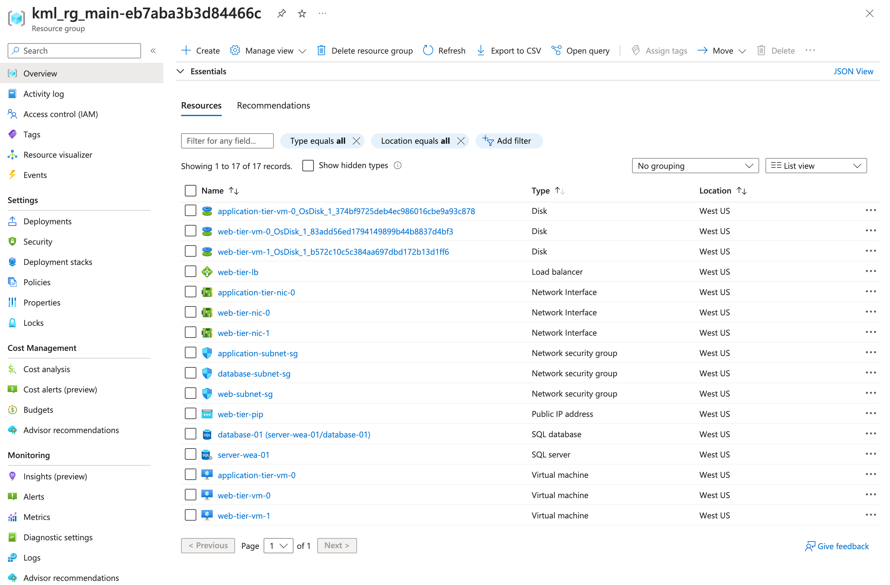

# Assignment 1: Azure Infrastructure Automation with Terraform

## How to deploy

1. Configure Azure credentials:  
  `az login`

2. Initialize Terraform:  
  `terraform init`

3. Deploy Infraestructure  
  `terraform apply`

## Considerations

*I tested this demo in KodeKlod Playground, so some limitations apply. For example, scale sets and some database redundancy options are not available.*

We could use Virtual machine scale sets for the web and application tier to achieve **high availability and scalability**. This would allow scaling on demand. However, an extra load balancer connection will be required for the web and application tier.

It's important to understand that, for simplicity and speed, I didn't configure a **remote backend for Terraform**. However, in a production environment, this configuration is mandatory. It allows all team members to access the configuration and helps avoid collisions, ensuring a smoother deployment process. 

### VMs security

Password authentication is not recommended. It would be better to use an SSH key in a production environment.

A bastion host and the corresponding network security rules may be required to access the instances using SSH, but they were not included as they are not part of the assignment.

## Screenshot

Deployed resurces:



## Cost breakdown

The cost was calculated using infracost. Another alternative, specially if you dont have the code yet, is use the Azure Calculator.

```
 Name                                                           Monthly Qty  Unit                      Monthly Cost 
                                                                                                                    
 azurerm_linux_virtual_machine.application_tier[0]                                                                  
 ├─ Instance usage (Linux, pay as you go, Standard_B1s)                 730  hours                            $9.05 
 └─ os_disk                                                                                                         
    ├─ Storage (S4, LRS)                                                  1  months                           $1.54 
    └─ Disk operations                                   Monthly cost depends on usage: $0.0005 per 10k operations  
                                                                                                                    
 azurerm_linux_virtual_machine.web_tier[0]                                                                          
 ├─ Instance usage (Linux, pay as you go, Standard_B1s)                 730  hours                            $9.05 
 └─ os_disk                                                                                                         
    ├─ Storage (S4, LRS)                                                  1  months                           $1.54 
    └─ Disk operations                                   Monthly cost depends on usage: $0.0005 per 10k operations  
                                                                                                                    
 azurerm_linux_virtual_machine.web_tier[1]                                                                          
 ├─ Instance usage (Linux, pay as you go, Standard_B1s)                 730  hours                            $9.05 
 └─ os_disk                                                                                                         
    ├─ Storage (S4, LRS)                                                  1  months                           $1.54 
    └─ Disk operations                                   Monthly cost depends on usage: $0.0005 per 10k operations  
                                                                                                                    
 azurerm_lb_rule.web_tier                                                                                           
 └─ Rule usage                                                          730  hours                            $7.30 
                                                                                                                    
 azurerm_public_ip.web_tier                                                                                         
 └─ IP address (static, regional)                                       730  hours                            $3.65 
                                                                                                                    
 azurerm_mssql_database.database                                                                                    
 ├─ Compute (serverless, GP_S_Gen5_2)                    Monthly cost depends on usage: $0.57 per vCore-hours       
 ├─ Zone redundancy (serverless, GP_S_Gen5_2)            Monthly cost depends on usage: $0.34 per vCore-hours       
 ├─ Storage                                                              10  GB                               $2.76 
 ├─ Long-term retention (LRS)                            Monthly cost depends on usage: $0.03 per GB                
 └─ PITR backup storage (LRS)                            Monthly cost depends on usage: $0.12 per GB                
                                                                                                                    
 azurerm_lb.web_tier                                                                                                
 └─ Data processed                                       Monthly cost depends on usage: $0.005 per GB               
                                                                                                                    
 OVERALL TOTAL                                                                                               $45.47 
──────────────────────────────────
35 cloud resources were detected:
∙ 7 were estimated
∙ 28 were free

┏━━━━━━━━━━━━━━━━━━━━━━━━━━━━━━━┳━━━━━━━━━━━━━━┓
┃ Project                       ┃ Monthly cost ┃
┣━━━━━━━━━━━━━━━━━━━━━━━━━━━━━━━╋━━━━━━━━━━━━━━┫
┃ eze-godoy/wenergy-assessment  ┃ $45          ┃
┗━━━━━━━━━━━━━━━━━━━━━━━━━━━━━━━┻━━━━━━━━━━━━━━┛
```